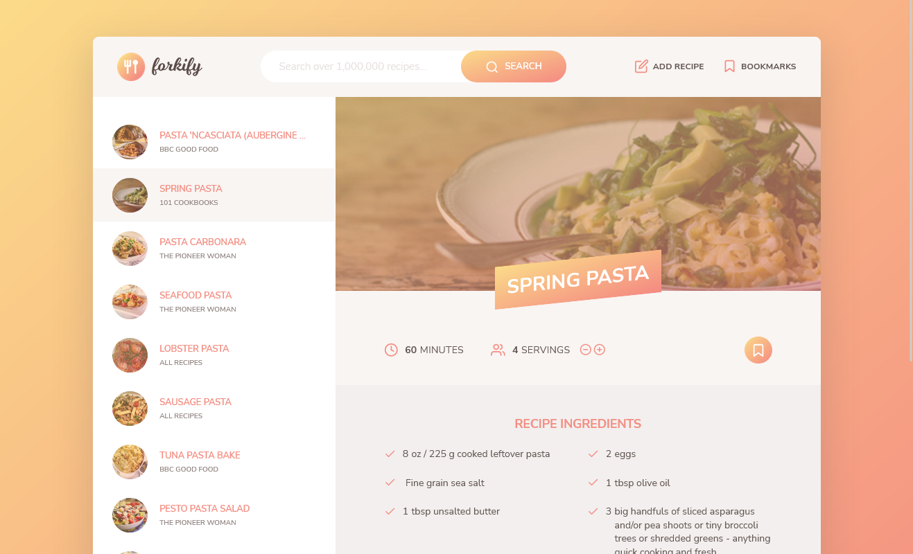

# Introduction

This  project is part of a course "The Complete JavaScript Course 2022: From Zero to Expert!" by Jonas Schmedtmann. This is recipe site, where we can search for different recipe from an API.

### Screenshot of app

## Flowchart

## Software Architecture

### Links

- [Live](https://forkify-rahidt.netlify.app/)

## Author

- LinkedIn - [@rahidt](https://www.linkedin.com/in/rahidt/)
